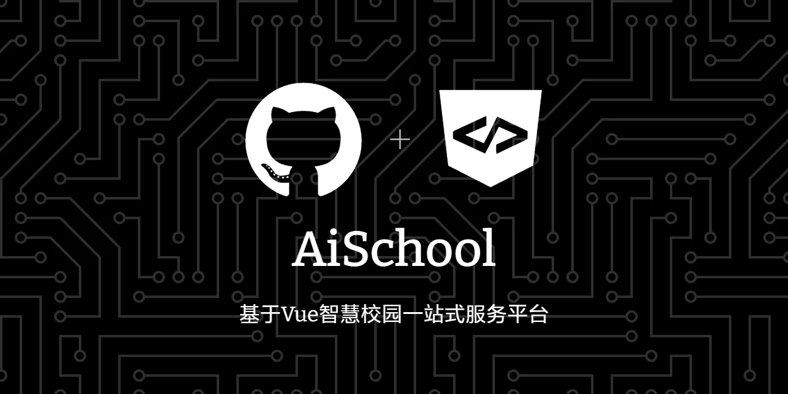

# Ai-School



## 简介

本项目是基于Vue2.0所实现的关于智慧校园一站式服务平台，主体部分使用`element-ui`实现，部分页面采用`BootStrap`完成。由于前后端分离，本项目是纯前端项目。感谢组长与组员们的共同努力。

## 项目配置

你需要在本地安装 [node](http://nodejs.org/) 。本项目技术栈基于 [ES2015+](http://es6.ruanyifeng.com/)、[vue](https://cn.vuejs.org/index.html)、[vue-router](https://router.vuejs.org/zh-cn/) 、[vue-cli](https://github.com/vuejs/vue-cli) 和 [element-ui](https://github.com/ElemeFE/element)。

使用`npm`安装依赖

```
npm install
```

## 编译并预览
```
npm run serve
```

## 编译打包

使用`npm`运行：

```bash
npm run build
```

得到静态文件服务器部署上线。

## 贡献

### 有用的指令


```bash
# 开启开发服务器，注意热更新不是很好用
# 如果你觉得哪里有问题，刷新页面即可
# 第一次运行打不开时，你可以试试刷新几次浏览器
npm run dev

# 测试
npm run test

# 测试某个组件
npm run test -- src/xxx

# 生成覆盖率报告
npm run test:cov

# 检查代码风格
npm run lint:code

# 检查类型
npm run lint:type

# 上面俩个都检查
npm run lint

# 构建文档网站（如果 vercel 的预览挂掉了，你可能需要先运行一下 `git clean -fdx`）
npm run build:site
```

**感谢一起努力组员们以及默默付出的组长**

## 许可

AiSchool 使用[GPL-3.0 License](https://github.com/Gaaraly/AiSchool/blob/main/LICENSE)许可证书。
